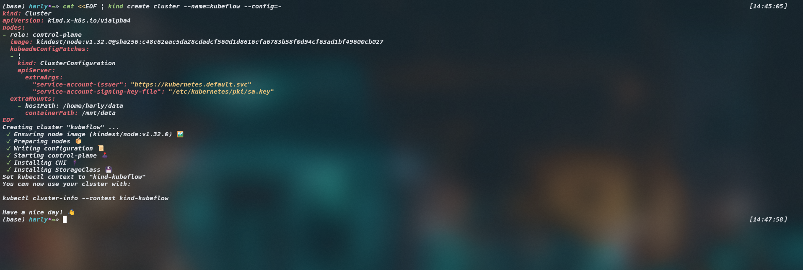
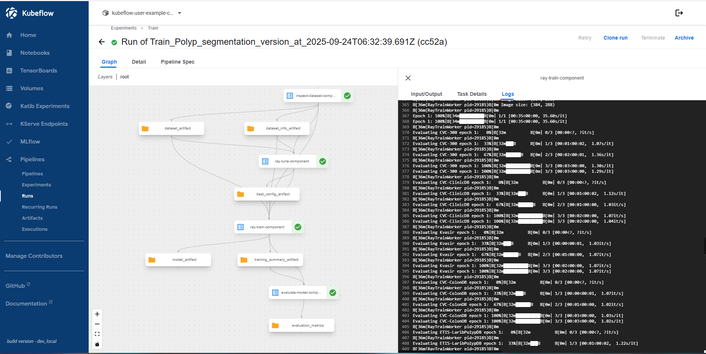

# 🩺 Polyp Segmentation System MLOps

## 📘 Overview

**Polyp-Segmentation-System-MLOps** is an end-to-end **medical image segmentation** platform designed to detect and segment **colorectal polyps** from endoscopic images.

This project goes beyond traditional model training — it show a complete MLOps system that automates the entire machine learning lifecycle: from data ingestion and training pipeline to deployment, monitoring, and continuous delivery.

The platform is orchestrated with **Kubeflow Pipelines** and deployed on **Google Kubernetes Engine (GKE)**, using **KServe (Triton Inference Server)** for scalable model serving.  

---

## 🧩 Architecture 

---

## 🧱 Stack Overview

| Category | Tools / Frameworks |
|-----------|-------------------|
| **Orchestration** | Kubeflow Pipelines, Jenkins |
| **Training** | PyTorch, Ray Train, Ray Tune |
| **Tracking** | MLflow (PostgreSQL + MinIO backend) |
| **Deployment** | KServe, Triton Inference Server |
| **Storage** | MinIO, GCS |
| **Monitoring** | Prometheus, Grafana |
| **Infrastructure** | GKE, Docker, Terraform |
| **UI** | Gradio  |


## Table of content


## ⚙️ Environment Setup

### 1. Clone the Repository
```bash
git clone https://github.com/Harly-1506/polyp-segmentation-mlops.git
cd polyp-segmentation-mlops
````

### 2. Create and Activate Environment with `uv`

```bash
conda create -n polyp_mlops python==3.12.9
conda activate polyp_mlops

pip install uv
uv sync --all-groups
```

---

## 🧪 Local Development

You can start with a **local environment** to verify training and MLflow tracking before deploying to the cluster.

### 1. Install Docker

Follow the official Docker installation guide:
👉 [Install Docker Engine](https://docs.docker.com/engine/install)

### 2. Run MLflow and MinIO Locally

```bash
docker compose -f docker-compose-mlflow.yaml up -d --build
```

### 3. Launch Local Ray Training

```bash
uv run --active -m training.ray_main --config training/configs/configs.yaml
```

This runs Ray-based distributed training while logging metrics and artifacts to **MLflow** (using **PostgreSQL** + **MinIO** backends).

---

## ☸️ Cluster Setup (Kind / GKE)

### 1. Install Helm & Kustomize

```bash
# Install Helm
curl https://raw.githubusercontent.com/helm/helm/main/scripts/get-helm-3 | bash

# Install Kustomize
curl -s "https://raw.githubusercontent.com/kubernetes-sigs/kustomize/master/hack/install_kustomize.sh" | bash
sudo mv kustomize /usr/local/bin/
```

### 2. Create Kind Cluster

```bash
cat <<EOF | kind create cluster --name=kubeflow --config=-
kind: Cluster
apiVersion: kind.x-k8s.io/v1alpha4
nodes:
- role: control-plane
  image: kindest/node:v1.32.0@sha256:c48c62eac5da28cdadcf560d1d8616cfa6783b58f0d94cf63ad1bf49600cb027
  kubeadmConfigPatches:
  - |
    kind: ClusterConfiguration
    apiServer:
      extraArgs:
        "service-account-issuer": "https://kubernetes.default.svc"
        "service-account-signing-key-file": "/etc/kubernetes/pki/sa.key"
  extraMounts:
    - hostPath: /home/harly/data
      containerPath: /mnt/data
EOF
```



**Save Kubeconfig**

```bash
kind get kubeconfig --name kubeflow > /tmp/kubeflow-config
export KUBECONFIG=/tmp/kubeflow-config
```

**Create Docker Registry Secret**

```bash
docker login

kubectl create secret generic regcred \
  --from-file=.dockerconfigjson=$HOME/.docker/config.json \
  --type=kubernetes.io/dockerconfigjson
```

---

## 📦 Kubeflow Deployment

Download and deploy the official Kubeflow manifests:

```bash
RELEASE=v1.10.1
git clone -b $RELEASE --depth 1 --single-branch https://github.com/kubeflow/manifests.git
cd manifests

while ! kustomize build example | kubectl apply --server-side --force-conflicts -f -; do 
  echo "Retrying to apply resources"
  sleep 20
done
```

---

## 🧾 MLflow Deployment

Create a namespace and deploy MLflow via Helm:

```bash
kubectl create namespace mlflow
kubens mlflow

docker build -t harly1506/mlflow-custom:v1.0 .
kind load docker-image harly1506/mlflow-custom:v1.0 --name kubeflow

helm install mlflow ./mlflow -f ./mlflow/values.yaml -n mlflow
helm upgrade mlflow mlflow -f mlflow/values.yaml
```

### Integrate MLflow into Kubeflow Dashboard

Edit the Kubeflow Central Dashboard ConfigMap:

```bash
kubectl -n kubeflow get configmap centraldashboard-config -o yaml
```

Then add this menu item under the dashboard JSON configuration:

```json
{
  "type": "item",
  "link": "/mlflow/",
  "text": "MLflow",
  "icon": "check"
}
```

---

## ⚡ KubeRay Installation

Deploy the KubeRay operator:

```bash
cd ray
kustomize build kuberay-operator/overlays/kubeflow | kubectl apply --server-side -f -
kubectl get pod -l app.kubernetes.io/component=kuberay-operator -n kubeflow
```

Expected output:

```
NAME                                READY   STATUS    RESTARTS   AGE
kuberay-operator-5b8cd69758-rkpvh   1/1     Running   0          6m
```

---

## 🧭 Namespace & RayCluster Setup

Create a new namespace and service account:

```bash
kubectl create ns development
kubectl create sa default-editor -n development
```

Modify the **RayCluster YAML**:

* Update the `AuthorizationPolicy` principal:

  ```yaml
  principals:
  - "cluster.local/ns/development/sa/default-editor"
  ```
* Update the node address for `headGroupSpec` and `workerGroupSpec`:

  ```yaml
  node-ip-address: $(hostname -I | tr -d ' ' | sed 's/\./-/g').raycluster-istio-headless-svc.development.svc.cluster.local
  ```

Deploy RayCluster:

```bash
cd ray
helm install raycluster ray-cluster -n development 
helm upgrade raycluster ray-cluster -n development -f values.yaml
```

---

## 🚀 Pipeline Integration

Build and push the image for Kubeflow Pipeline:

```bash
docker build -t harly1506/polyp-mlops:kfpv2 .
kind load docker-image harly1506/polyp-mlops:kfpv2 --name kubeflow
```

Run this to generate pipeline yaml
```python
 uv run training/orchestration/kube_pipeline.py 
 ``` 

 Upload file ray_segmentation_pipeline_v9.yaml on kubeflow portal

 

